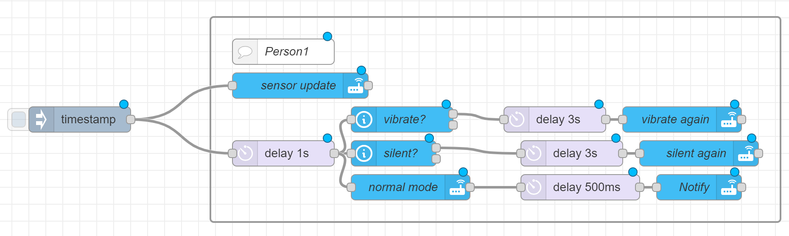
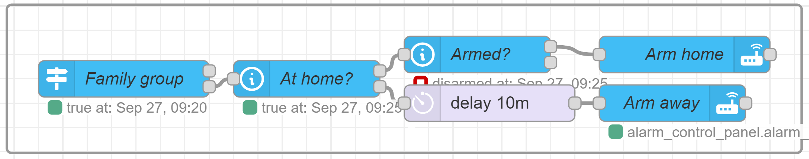
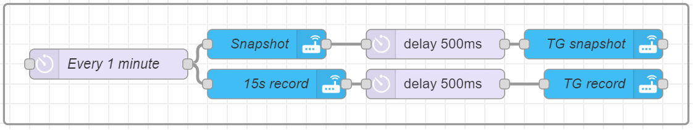
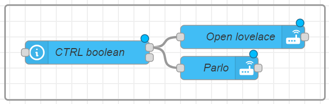
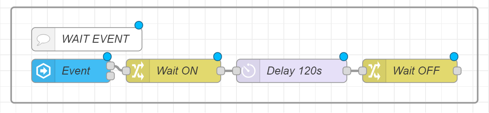
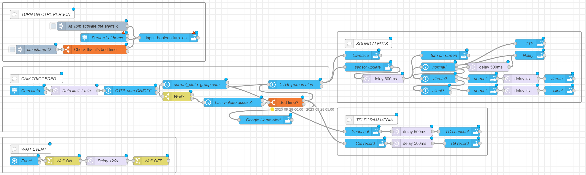

###### Camera_surveillance_system

Operated by Node Red

_Under development_

##### [Node Red](https://nodered.org/)
##### Personally I use [Reolink](https://reolink.com/) cameras, having people and vehicle recognition.
###### The other cameras I tried, like the TP-Link, use their own server to process the images, so the intelligent recognition stops working as soon as I block their internet access

#### As a conditional for the trigger I use non-presence at home, which I obtain thanks to the IP of the device with a fixed MAC address
As a result, in the configuration.yaml I have:
```
device_tracker:
  - platform: ping
    hosts:
      person1: !secret person1_ip
    consider_home: 100
    interval_seconds: 10
```
###### If you want more control, you can interact it with an input_boolean as a conditional


```
[{"id":"4879e8e3cf01b3d5","type":"trigger-state","z":"4c716a532f554ef5","name":"Person1 at home","server":"","version":2,"exposeToHomeAssistant":false,"haConfig":[{"property":"name","value":""},{"property":"icon","value":""}],"entityidfiltertype":"exact","debugenabled":false,"constraints":[{"targetType":"this_entity","targetValue":"","propertyType":"current_state","propertyValue":"new_state.state","comparatorType":"is","comparatorValueDatatype":"bool","comparatorValue":"true"}],"inputs":0,"outputs":2,"customoutputs":[],"outputinitially":false,"state_type":"habool","enableInput":false,"x":700,"y":640,"wires":[[],["58e2063bc8e27370"]]},{"id":"6285290d5d5a4108","type":"inject","z":"4c716a532f554ef5","name":"At 1pm activate the alerts","props":[{"p":"payload"},{"p":"topic","vt":"str"}],"repeat":"","crontab":"00 13 * * *","once":false,"onceDelay":0.1,"topic":"","payload":"","payloadType":"date","x":660,"y":600,"wires":[["58e2063bc8e27370"]]},{"id":"58e2063bc8e27370","type":"api-call-service","z":"4c716a532f554ef5","name":"","server":"","version":5,"debugenabled":false,"domain":"input_boolean","service":"turn_on","areaId":[],"deviceId":[],"entityId":["input_boolean.boolean"],"data":"","dataType":"jsonata","mergeContext":"","mustacheAltTags":false,"outputProperties":[],"queue":"none","x":920,"y":640,"wires":[[]]},{"id":"a541fe4cbe54f3a4","type":"inject","z":"4c716a532f554ef5","name":"timestamp","props":[{"p":"payload"},{"p":"topic","vt":"str"}],"repeat":"","crontab":"*/5 0-5 * * *","once":false,"onceDelay":0.1,"topic":"","payload":"","payloadType":"date","x":470,"y":680,"wires":[["15fcd250a44eee1f"]]},{"id":"15fcd250a44eee1f","type":"time-range-switch","z":"4c716a532f554ef5","name":"Check that it's bed time","lat":"","lon":"","startTime":"00:00","endTime":"05:00","startOffset":0,"endOffset":0,"x":670,"y":680,"wires":[["58e2063bc8e27370"],[]]}]
```
____
To receive the notification with sound even if in silent, I play with sensor.ringer_mode
###### (sensor that can be activated in the companion app settings)



```
[{"id":"20eefc769f3bca41","type":"inject","z":"4c716a532f554ef5","name":"","props":[{"p":"payload"},{"p":"topic","vt":"str"}],"repeat":"","crontab":"","once":false,"onceDelay":0.1,"topic":"","payload":"","payloadType":"date","x":180,"y":660,"wires":[["59ca3e51f75375a7","33152b1bc0a9a91c"]]},{"id":"f71e97cdc0c02c70","type":"group","z":"4c716a532f554ef5","style":{"stroke":"#999999","stroke-opacity":"1","fill":"none","fill-opacity":"1","label":true,"label-position":"nw","color":"#a4a4a4"},"nodes":["f7dc3e416c1b2e87","d18d40a53261c5d7","dab13fc387c9c28d","2ac1f6da0bd08d8b","9105b3aced88dc3a","e2ded0e23adeb30f","b9d8126e6f50b6fd","2f80aa91237ffd7c","8b880429eb88a036","59ca3e51f75375a7","33152b1bc0a9a91c","75c0b56e0cfa816c"],"x":274,"y":539,"w":672,"h":242},{"id":"f7dc3e416c1b2e87","type":"api-call-service","z":"4c716a532f554ef5","g":"f71e97cdc0c02c70","name":"Notify","server":"","version":5,"debugenabled":false,"domain":"notify","service":"mobile_app_phone","areaId":[],"deviceId":[],"entityId":[],"data":"{\t   \"message\":\"Someone detected\",\t   \"title\":\"Alarm\",\t   \"data\":{\t        \"group\": \"Surveillance\"\t   }\t}","dataType":"jsonata","mergeContext":"","mustacheAltTags":false,"outputProperties":[],"queue":"none","x":850,"y":740,"wires":[[]]},{"id":"d18d40a53261c5d7","type":"api-call-service","z":"4c716a532f554ef5","g":"f71e97cdc0c02c70","name":"normal mode","server":"","version":5,"debugenabled":false,"domain":"notify","service":"mobile_app_phone","areaId":[],"deviceId":[],"entityId":[],"data":"{\t   \"message\":\"command_ringer_mode\",\t   \"data\": {\t        \"command\":\"normal\"\t   }\t}","dataType":"jsonata","mergeContext":"","mustacheAltTags":false,"outputProperties":[],"queue":"none","x":510,"y":740,"wires":[["dab13fc387c9c28d"]]},{"id":"dab13fc387c9c28d","type":"delay","z":"4c716a532f554ef5","g":"f71e97cdc0c02c70","name":"","pauseType":"delay","timeout":"500","timeoutUnits":"milliseconds","rate":"1","nbRateUnits":"1","rateUnits":"second","randomFirst":"1","randomLast":"5","randomUnits":"seconds","drop":false,"allowrate":false,"outputs":1,"x":710,"y":740,"wires":[["f7dc3e416c1b2e87"]]},{"id":"2ac1f6da0bd08d8b","type":"api-current-state","z":"4c716a532f554ef5","g":"f71e97cdc0c02c70","name":"vibrate?","server":"","version":3,"outputs":2,"halt_if":"vibrate","halt_if_type":"str","halt_if_compare":"is","entity_id":"sensor.opandrea_ringer_mode_12","state_type":"str","blockInputOverrides":false,"outputProperties":[{"property":"payload","propertyType":"msg","value":"","valueType":"entityState"}],"for":"0","forType":"num","forUnits":"minutes","override_topic":false,"state_location":"payload","override_payload":"msg","entity_location":"data","override_data":"msg","x":500,"y":660,"wires":[["9105b3aced88dc3a"],[]]},{"id":"9105b3aced88dc3a","type":"delay","z":"4c716a532f554ef5","g":"f71e97cdc0c02c70","name":"","pauseType":"delay","timeout":"3","timeoutUnits":"seconds","rate":"1","nbRateUnits":"1","rateUnits":"second","randomFirst":"1","randomLast":"5","randomUnits":"seconds","drop":false,"allowrate":false,"outputs":1,"x":680,"y":660,"wires":[["e2ded0e23adeb30f"]]},{"id":"e2ded0e23adeb30f","type":"api-call-service","z":"4c716a532f554ef5","g":"f71e97cdc0c02c70","name":"vibrate again","server":"","version":5,"debugenabled":false,"domain":"notify","service":"mobile_app_phone","areaId":[],"deviceId":[],"entityId":[],"data":"{\t   \"message\":\"command_ringer_mode\",\t   \"data\": {\t        \"command\":\"vibrate\"\t   }\t}","dataType":"jsonata","mergeContext":"","mustacheAltTags":false,"outputProperties":[],"queue":"none","x":830,"y":660,"wires":[[]]},{"id":"b9d8126e6f50b6fd","type":"api-current-state","z":"4c716a532f554ef5","g":"f71e97cdc0c02c70","name":"silent?","server":"","version":3,"outputs":2,"halt_if":"silent","halt_if_type":"str","halt_if_compare":"is","entity_id":"sensor.opandrea_ringer_mode_12","state_type":"str","blockInputOverrides":false,"outputProperties":[{"property":"payload","propertyType":"msg","value":"","valueType":"entityState"}],"for":"0","forType":"num","forUnits":"minutes","override_topic":false,"state_location":"payload","override_payload":"msg","entity_location":"data","override_data":"msg","x":490,"y":700,"wires":[["2f80aa91237ffd7c"],[]]},{"id":"2f80aa91237ffd7c","type":"delay","z":"4c716a532f554ef5","g":"f71e97cdc0c02c70","name":"","pauseType":"delay","timeout":"3","timeoutUnits":"seconds","rate":"1","nbRateUnits":"1","rateUnits":"second","randomFirst":"1","randomLast":"5","randomUnits":"seconds","drop":false,"allowrate":false,"outputs":1,"x":700,"y":700,"wires":[["8b880429eb88a036"]]},{"id":"8b880429eb88a036","type":"api-call-service","z":"4c716a532f554ef5","g":"f71e97cdc0c02c70","name":"silent again","server":"","version":5,"debugenabled":false,"domain":"notify","service":"mobile_app_phone","areaId":[],"deviceId":[],"entityId":[],"data":"{\t   \"message\":\"command_ringer_mode\",\t   \"data\": {\t        \"command\":\"silent\"\t   }\t}","dataType":"jsonata","mergeContext":"","mustacheAltTags":false,"outputProperties":[],"queue":"none","x":850,"y":700,"wires":[[]]},{"id":"59ca3e51f75375a7","type":"api-call-service","z":"4c716a532f554ef5","g":"f71e97cdc0c02c70","name":"sensor update","server":"","version":5,"debugenabled":false,"domain":"notify","service":"mobile_app_phone","areaId":[],"deviceId":[],"entityId":[],"data":"{\t   \"message\":\"command_update_sensors\"\t}","dataType":"jsonata","mergeContext":"","mustacheAltTags":false,"outputProperties":[],"queue":"none","x":380,"y":620,"wires":[[]]},{"id":"33152b1bc0a9a91c","type":"delay","z":"4c716a532f554ef5","g":"f71e97cdc0c02c70","name":"","pauseType":"delay","timeout":"1","timeoutUnits":"seconds","rate":"1","nbRateUnits":"1","rateUnits":"second","randomFirst":"1","randomLast":"5","randomUnits":"seconds","drop":false,"allowrate":false,"outputs":1,"x":360,"y":700,"wires":[["b9d8126e6f50b6fd","2ac1f6da0bd08d8b","d18d40a53261c5d7"]]},{"id":"75c0b56e0cfa816c","type":"comment","z":"4c716a532f554ef5","g":"f71e97cdc0c02c70","name":"Person1","info":"","x":360,"y":580,"wires":[]}]
```
____
#### Arm the alarm when everyone leaves home.

```
[{"id":"9fd53316798a2062","type":"trigger-state","z":"c7248b1f7d1e034f","g":"f36233b8c7ff738e","name":"Family group","server":"84316002.41205","version":2,"exposeToHomeAssistant":false,"haConfig":[{"property":"name","value":""},{"property":"icon","value":""}],"entityid":"group.famiglia","entityidfiltertype":"exact","debugenabled":false,"constraints":[{"targetType":"this_entity","targetValue":"","propertyType":"current_state","propertyValue":"new_state.state","comparatorType":"is","comparatorValueDatatype":"bool","comparatorValue":"true"}],"inputs":0,"outputs":2,"customoutputs":[],"outputinitially":false,"state_type":"habool","enableInput":false,"x":270,"y":1840,"wires":[[],["d17f691b38bc4e2b"]]},{"id":"d17f691b38bc4e2b","type":"api-current-state","z":"c7248b1f7d1e034f","g":"f36233b8c7ff738e","name":"At home?","server":"84316002.41205","version":3,"outputs":2,"halt_if":"true","halt_if_type":"bool","halt_if_compare":"is","entity_id":"group.famiglia","state_type":"habool","blockInputOverrides":false,"outputProperties":[{"property":"payload","propertyType":"msg","value":"","valueType":"entityState"},{"property":"data","propertyType":"msg","value":"","valueType":"entity"}],"for":"0","forType":"num","forUnits":"minutes","override_topic":false,"state_location":"payload","override_payload":"msg","entity_location":"data","override_data":"msg","x":420,"y":1840,"wires":[["6da405ca236c5c19"],["f813ae308bf9ce7b"]]},{"id":"6da405ca236c5c19","type":"api-current-state","z":"c7248b1f7d1e034f","g":"f36233b8c7ff738e","name":"Armed?","server":"84316002.41205","version":3,"outputs":2,"halt_if":"disarmed","halt_if_type":"str","halt_if_compare":"is_not","entity_id":"alarm_control_panel.allarme_casa","state_type":"str","blockInputOverrides":false,"outputProperties":[{"property":"payload","propertyType":"msg","value":"","valueType":"entityState"},{"property":"data","propertyType":"msg","value":"","valueType":"entity"}],"for":"0","forType":"num","forUnits":"minutes","override_topic":false,"state_location":"payload","override_payload":"msg","entity_location":"data","override_data":"msg","x":560,"y":1820,"wires":[["11034f5d96d41c8e"],[]]},{"id":"f813ae308bf9ce7b","type":"delay","z":"c7248b1f7d1e034f","g":"f36233b8c7ff738e","name":"","pauseType":"delay","timeout":"10","timeoutUnits":"minutes","rate":"1","nbRateUnits":"1","rateUnits":"second","randomFirst":"1","randomLast":"5","randomUnits":"seconds","drop":false,"allowrate":false,"outputs":1,"x":570,"y":1860,"wires":[["36f6dfce4fb19dbc"]]},{"id":"36f6dfce4fb19dbc","type":"api-call-service","z":"c7248b1f7d1e034f","g":"f36233b8c7ff738e","name":"Arm away","server":"84316002.41205","version":5,"debugenabled":false,"domain":"alarm_control_panel","service":"alarm_arm_away","areaId":[],"deviceId":[],"entityId":["alarm_control_panel.allarme_casa"],"data":"{\"code\":\"!secret alarm_code\"}","dataType":"json","mergeContext":"","mustacheAltTags":false,"outputProperties":[],"queue":"none","x":720,"y":1860,"wires":[[]]},{"id":"11034f5d96d41c8e","type":"api-call-service","z":"c7248b1f7d1e034f","g":"f36233b8c7ff738e","name":"Arm home","server":"84316002.41205","version":5,"debugenabled":false,"domain":"alarm_control_panel","service":"alarm_arm_home","areaId":[],"deviceId":[],"entityId":["alarm_control_panel.allarme_casa"],"data":"{\"code\":\"!secret alarm_code\"}","dataType":"json","mergeContext":"","mustacheAltTags":false,"outputProperties":[],"queue":"none","x":730,"y":1820,"wires":[[]]},{"id":"84316002.41205","type":"server","name":"Home Assistant","version":5,"addon":true,"rejectUnauthorizedCerts":true,"ha_boolean":"y|yes|true|on|home|open","connectionDelay":true,"cacheJson":true,"heartbeat":false,"heartbeatInterval":30,"areaSelector":"friendlyName","deviceSelector":"friendlyName","entitySelector":"friendlyName","statusSeparator":"at: ","statusYear":"hidden","statusMonth":"short","statusDay":"numeric","statusHourCycle":"h23","statusTimeFormat":"h:m","enableGlobalContextStore":true}]
```
____
#### Telegram media

```
[{"id":"9e353cb5b6ca85a9","type":"delay","z":"4c716a532f554ef5","g":"31609148d5447ca9","name":"Every 1 minute","pauseType":"rate","timeout":"1","timeoutUnits":"minutes","rate":"1","nbRateUnits":"60","rateUnits":"second","randomFirst":"1","randomLast":"5","randomUnits":"seconds","drop":true,"allowrate":false,"outputs":1,"x":440,"y":960,"wires":[["f9a94883ead1448b","b2d999b9dbbca1d4"]]},{"id":"f9a94883ead1448b","type":"api-call-service","z":"4c716a532f554ef5","g":"31609148d5447ca9","name":"Snapshot","server":"84316002.41205","version":5,"debugenabled":false,"domain":"camera","service":"snapshot","areaId":[],"deviceId":[],"entityId":[],"data":"{\"filename\":\"/config/www/camera/snapshot.jpeg\"}","dataType":"jsonata","mergeContext":"","mustacheAltTags":false,"outputProperties":[],"queue":"none","x":600,"y":940,"wires":[["142907d78e9e3b0d"]]},{"id":"b2d999b9dbbca1d4","type":"api-call-service","z":"4c716a532f554ef5","g":"31609148d5447ca9","name":"15s record","server":"84316002.41205","version":5,"debugenabled":false,"domain":"camera","service":"record","areaId":[],"deviceId":[],"entityId":[],"data":"{\"filename\":\"/config/www/camera/record.mp4\",\"duration\":\"15\"}","dataType":"jsonata","mergeContext":"","mustacheAltTags":false,"outputProperties":[],"queue":"none","x":610,"y":980,"wires":[["c8125ddb576a2269"]]},{"id":"142907d78e9e3b0d","type":"delay","z":"4c716a532f554ef5","g":"31609148d5447ca9","name":"","pauseType":"delay","timeout":"500","timeoutUnits":"milliseconds","rate":"1","nbRateUnits":"1","rateUnits":"second","randomFirst":"1","randomLast":"5","randomUnits":"seconds","drop":false,"allowrate":false,"outputs":1,"x":770,"y":940,"wires":[["5d5a6362d21a1da7"]]},{"id":"c8125ddb576a2269","type":"delay","z":"4c716a532f554ef5","g":"31609148d5447ca9","name":"","pauseType":"delay","timeout":"500","timeoutUnits":"milliseconds","rate":"1","nbRateUnits":"1","rateUnits":"second","randomFirst":"1","randomLast":"5","randomUnits":"seconds","drop":false,"allowrate":false,"outputs":1,"x":770,"y":980,"wires":[["40aa646771247cd5"]]},{"id":"5d5a6362d21a1da7","type":"api-call-service","z":"4c716a532f554ef5","g":"31609148d5447ca9","name":"TG snapshot","server":"84316002.41205","version":5,"debugenabled":false,"domain":"telegram_bot","service":"send_photo","areaId":[],"deviceId":[],"entityId":[],"data":"{\"file\":\"/config/www/camera/snapshot.jpeg\",\"caption\":\"<Name>\",\"target\":\"<chat_id>\"}","dataType":"jsonata","mergeContext":"","mustacheAltTags":false,"outputProperties":[],"queue":"none","x":930,"y":940,"wires":[[]]},{"id":"40aa646771247cd5","type":"api-call-service","z":"4c716a532f554ef5","g":"31609148d5447ca9","name":"TG record","server":"84316002.41205","version":5,"debugenabled":false,"domain":"telegram_bot","service":"send_video","areaId":[],"deviceId":[],"entityId":[],"data":"{\"file\":\"/config/www/camera/record.mp4\",\"caption\":\"<Name>\",\"target\":\"<chat_id>\"}","dataType":"jsonata","mergeContext":"","mustacheAltTags":false,"outputProperties":[],"queue":"none","x":940,"y":980,"wires":[[]]},{"id":"84316002.41205","type":"server","name":"Home Assistant","version":5,"addon":true,"rejectUnauthorizedCerts":true,"ha_boolean":"y|yes|true|on|home|open","connectionDelay":true,"cacheJson":true,"heartbeat":false,"heartbeatInterval":30,"areaSelector":"friendlyName","deviceSelector":"friendlyName","entitySelector":"friendlyName","statusSeparator":"at: ","statusYear":"hidden","statusMonth":"short","statusDay":"numeric","statusHourCycle":"h23","statusTimeFormat":"h:m","enableGlobalContextStore":true}]
```
____

### Text To Speach and lovelace opening of video surveillance
The TTS is only called if a control boolean is true.

```
[{"id":"857dc0dc25f43af6","type":"api-current-state","z":"4c716a532f554ef5","name":"CTRL boolean","server":"84316002.41205","version":3,"outputs":2,"halt_if":"true","halt_if_type":"bool","halt_if_compare":"is","entity_id":"input_boolean.","state_type":"habool","blockInputOverrides":false,"outputProperties":[{"property":"payload","propertyType":"msg","value":"","valueType":"entityState"},{"property":"data","propertyType":"msg","value":"","valueType":"entity"}],"for":0,"forType":"num","forUnits":"minutes","x":1780,"y":1140,"wires":[["f4347a8c7476a1ce","81bfa1d018fcf7a1"],[]]},{"id":"f4347a8c7476a1ce","type":"api-call-service","z":"4c716a532f554ef5","name":"Open lovelace","server":"84316002.41205","version":5,"debugenabled":false,"domain":"notify","service":"mobile_app_opandrea","areaId":[],"deviceId":[],"entityId":[],"data":"{\t   \"message\":\"command_webview\",\t   \"data\": {\t        \"command\": \"/lovelace/webcam\"\t   }\t}","dataType":"jsonata","mergeContext":"","mustacheAltTags":false,"outputProperties":[],"queue":"none","x":1980,"y":1120,"wires":[[]]},{"id":"81bfa1d018fcf7a1","type":"api-call-service","z":"4c716a532f554ef5","name":"TTS","server":"84316002.41205","version":5,"debugenabled":false,"domain":"notify","service":"mobile_app_opandrea","areaId":[],"deviceId":[],"entityId":[],"data":"{\t   \"message\":\"TTS\",\t   \"data\":{\t        \"tl\": \"0\",\t        \"priority\": \"high\",\t        \"media_stream\": \"alarm_stream_max\",\t        \"tts_text\": \"<message>\"\t   }\t}","dataType":"jsonata","mergeContext":"","mustacheAltTags":false,"outputProperties":[],"queue":"none","x":1950,"y":1160,"wires":[[]]},{"id":"84316002.41205","type":"server","name":"Home Assistant","version":5,"addon":true,"rejectUnauthorizedCerts":true,"ha_boolean":"y|yes|true|on|home|open","connectionDelay":true,"cacheJson":true,"heartbeat":false,"heartbeatInterval":30,"areaSelector":"friendlyName","deviceSelector":"friendlyName","entitySelector":"friendlyName","statusSeparator":"at: ","statusYear":"hidden","statusMonth":"short","statusDay":"numeric","statusHourCycle":"h23","statusTimeFormat":"h:m","enableGlobalContextStore":true}]
```
____
### Waiting caused by an event

```
[{"id":"faec08c78ddb5d1d","type":"group","z":"4c716a532f554ef5","style":{"stroke":"#999999","stroke-opacity":"1","fill":"none","fill-opacity":"1","label":true,"label-position":"nw","color":"#a4a4a4"},"nodes":["b69c8b3f02e25aa5","4adc0ff9f2948a20","6a0753e6ac53cfcd","367e619d5fe7e285","82a4318d64076d80"],"x":34,"y":1019,"w":592,"h":122},{"id":"b69c8b3f02e25aa5","type":"server-state-changed","z":"4c716a532f554ef5","g":"faec08c78ddb5d1d","name":"Event","server":"84316002.41205","version":4,"exposeToHomeAssistant":false,"haConfig":[{"property":"name","value":""},{"property":"icon","value":""}],"entityidfilter":"switch.cancello","entityidfiltertype":"exact","outputinitially":false,"state_type":"str","haltifstate":"on","halt_if_type":"str","halt_if_compare":"is","outputs":2,"output_only_on_state_change":true,"for":"0","forType":"num","forUnits":"minutes","ignorePrevStateNull":false,"ignorePrevStateUnknown":false,"ignorePrevStateUnavailable":false,"ignoreCurrentStateUnknown":false,"ignoreCurrentStateUnavailable":false,"outputProperties":[{"property":"payload","propertyType":"msg","value":"","valueType":"entityState"},{"property":"data","propertyType":"msg","value":"","valueType":"eventData"},{"property":"topic","propertyType":"msg","value":"","valueType":"triggerId"}],"x":110,"y":1100,"wires":[["4adc0ff9f2948a20"],[]]},{"id":"4adc0ff9f2948a20","type":"change","z":"4c716a532f554ef5","g":"faec08c78ddb5d1d","name":"Wait ON","rules":[{"t":"set","p":"event","pt":"flow","to":"true","tot":"bool"}],"action":"","property":"","from":"","to":"","reg":false,"x":240,"y":1100,"wires":[["6a0753e6ac53cfcd"]]},{"id":"6a0753e6ac53cfcd","type":"delay","z":"4c716a532f554ef5","g":"faec08c78ddb5d1d","name":"Delay 120s","pauseType":"delay","timeout":"120","timeoutUnits":"seconds","rate":"1","nbRateUnits":"120","rateUnits":"second","randomFirst":"1","randomLast":"5","randomUnits":"seconds","drop":true,"allowrate":false,"outputs":1,"x":390,"y":1100,"wires":[["367e619d5fe7e285"]]},{"id":"367e619d5fe7e285","type":"change","z":"4c716a532f554ef5","g":"faec08c78ddb5d1d","name":"Wait OFF","rules":[{"t":"set","p":"event","pt":"flow","to":"false","tot":"bool"}],"action":"","property":"","from":"","to":"","reg":false,"x":540,"y":1100,"wires":[[]]},{"id":"82a4318d64076d80","type":"comment","z":"4c716a532f554ef5","g":"faec08c78ddb5d1d","name":"WAIT EVENT","info":"","x":130,"y":1060,"wires":[]},{"id":"84316002.41205","type":"server","name":"Home Assistant","version":5,"addon":true,"rejectUnauthorizedCerts":true,"ha_boolean":"y|yes|true|on|home|open","connectionDelay":true,"cacheJson":true,"heartbeat":false,"heartbeatInterval":30,"areaSelector":"friendlyName","deviceSelector":"friendlyName","entitySelector":"friendlyName","statusSeparator":"at: ","statusYear":"hidden","statusMonth":"short","statusDay":"numeric","statusHourCycle":"h23","statusTimeFormat":"h:m","enableGlobalContextStore":true}]
```

# FULL FLOW

```
[{"id":"72200c5e860aa15d","type":"group","z":"4c716a532f554ef5","style":{"stroke":"#999999","stroke-opacity":"1","fill":"none","fill-opacity":"1","label":true,"label-position":"nw","color":"#a4a4a4"},"nodes":["f09198b2b632bb7c","8106bf98c71c6794","e12bcdb415f43ad2","37558007fe3799ec","89ab9a7851e06eb4","7ffbce8649a8f901","2edb04659771c212","87878c5db7bed8ee","c89fc8e4e902cf78","8aa43f54e74e4b01","f225fd057653e669","d323a831c1d23ea0","f62b998b6598bf75","436c3a1f358e1aef","c7a2e11c7a56fa1a","46cd50ce87107183","b3f080d9367f38df"],"x":1174,"y":659,"w":832,"h":242},{"id":"f09198b2b632bb7c","type":"comment","z":"4c716a532f554ef5","g":"72200c5e860aa15d","name":"SOUND ALERTS","info":"","x":1280,"y":700,"wires":[]},{"id":"8106bf98c71c6794","type":"delay","z":"4c716a532f554ef5","g":"72200c5e860aa15d","name":"","pauseType":"delay","timeout":"500","timeoutUnits":"milliseconds","rate":"1","nbRateUnits":"1","rateUnits":"second","randomFirst":"1","randomLast":"5","randomUnits":"seconds","drop":false,"allowrate":false,"outputs":1,"x":1330,"y":820,"wires":[["f62b998b6598bf75","b3f080d9367f38df"]]},{"id":"e12bcdb415f43ad2","type":"api-call-service","z":"4c716a532f554ef5","g":"72200c5e860aa15d","name":"sensor update","server":"84316002.41205","version":5,"debugenabled":false,"domain":"notify","service":"mobile_app_opandrea","areaId":[],"deviceId":[],"entityId":[],"data":"{\t   \"message\":\"command_update_sensors\"\t}","dataType":"jsonata","mergeContext":"","mustacheAltTags":false,"outputProperties":[],"queue":"none","x":1280,"y":780,"wires":[["8106bf98c71c6794"]]},{"id":"37558007fe3799ec","type":"api-call-service","z":"4c716a532f554ef5","g":"72200c5e860aa15d","name":"normal","server":"84316002.41205","version":5,"debugenabled":false,"domain":"notify","service":"mobile_app_opandrea","areaId":[],"deviceId":[],"entityId":[],"data":"{\t   \"message\":\"command_ringer_mode\",\t   \"data\": {\t        \"command\": \"normal\"\t   }\t}","dataType":"jsonata","mergeContext":"","mustacheAltTags":false,"outputProperties":[],"queue":"none","x":1670,"y":820,"wires":[["89ab9a7851e06eb4"]]},{"id":"89ab9a7851e06eb4","type":"delay","z":"4c716a532f554ef5","g":"72200c5e860aa15d","name":"","pauseType":"delay","timeout":"4","timeoutUnits":"seconds","rate":"1","nbRateUnits":"1","rateUnits":"second","randomFirst":"1","randomLast":"5","randomUnits":"seconds","drop":false,"allowrate":false,"outputs":1,"x":1800,"y":820,"wires":[["7ffbce8649a8f901"]]},{"id":"7ffbce8649a8f901","type":"api-call-service","z":"4c716a532f554ef5","g":"72200c5e860aa15d","name":"vibrate","server":"84316002.41205","version":5,"debugenabled":false,"domain":"notify","service":"mobile_app_opandrea","areaId":[],"deviceId":[],"entityId":[],"data":"{\t   \"message\":\"command_ringer_mode\",\t   \"data\": {\t        \"command\": \"vibrate\"\t   }\t}","dataType":"jsonata","mergeContext":"","mustacheAltTags":false,"outputProperties":[],"queue":"none","x":1930,"y":820,"wires":[[]]},{"id":"2edb04659771c212","type":"api-current-state","z":"4c716a532f554ef5","g":"72200c5e860aa15d","name":"vibrate?","server":"84316002.41205","version":3,"outputs":2,"halt_if":"vibrate","halt_if_type":"str","halt_if_compare":"is","entity_id":"sensor.opandrea_ringer_mode","state_type":"str","blockInputOverrides":false,"outputProperties":[{"property":"payload","propertyType":"msg","value":"","valueType":"entityState"}],"for":"0","forType":"num","forUnits":"minutes","override_topic":false,"state_location":"payload","override_payload":"msg","entity_location":"data","override_data":"msg","x":1520,"y":820,"wires":[["37558007fe3799ec"],["f225fd057653e669"]]},{"id":"87878c5db7bed8ee","type":"api-call-service","z":"4c716a532f554ef5","g":"72200c5e860aa15d","name":"normal","server":"84316002.41205","version":5,"debugenabled":false,"domain":"notify","service":"mobile_app_opandrea","areaId":[],"deviceId":[],"entityId":[],"data":"{\t   \"message\":\"command_ringer_mode\",\t   \"data\": {\t        \"command\": \"normal\"\t   }\t}","dataType":"jsonata","mergeContext":"","mustacheAltTags":false,"outputProperties":[],"queue":"none","x":1670,"y":860,"wires":[["c89fc8e4e902cf78"]]},{"id":"c89fc8e4e902cf78","type":"delay","z":"4c716a532f554ef5","g":"72200c5e860aa15d","name":"","pauseType":"delay","timeout":"4","timeoutUnits":"seconds","rate":"1","nbRateUnits":"1","rateUnits":"second","randomFirst":"1","randomLast":"5","randomUnits":"seconds","drop":false,"allowrate":false,"outputs":1,"x":1800,"y":860,"wires":[["8aa43f54e74e4b01"]]},{"id":"8aa43f54e74e4b01","type":"api-call-service","z":"4c716a532f554ef5","g":"72200c5e860aa15d","name":"vibrate","server":"84316002.41205","version":5,"debugenabled":false,"domain":"notify","service":"mobile_app_opandrea","areaId":[],"deviceId":[],"entityId":[],"data":"{\t   \"message\":\"command_ringer_mode\",\t   \"data\": {\t        \"command\": \"silent\"\t   }\t}","dataType":"jsonata","mergeContext":"","mustacheAltTags":false,"outputProperties":[],"queue":"none","x":1930,"y":860,"wires":[[]]},{"id":"f225fd057653e669","type":"api-current-state","z":"4c716a532f554ef5","g":"72200c5e860aa15d","name":"silent?","server":"84316002.41205","version":3,"outputs":2,"halt_if":"silent","halt_if_type":"str","halt_if_compare":"is","entity_id":"sensor.opandrea_ringer_mode","state_type":"str","blockInputOverrides":false,"outputProperties":[{"property":"payload","propertyType":"msg","value":"","valueType":"entityState"}],"for":"0","forType":"num","forUnits":"minutes","override_topic":false,"state_location":"payload","override_payload":"msg","entity_location":"data","override_data":"msg","x":1510,"y":860,"wires":[["87878c5db7bed8ee"],[]]},{"id":"d323a831c1d23ea0","type":"api-call-service","z":"4c716a532f554ef5","g":"72200c5e860aa15d","name":"Lovelace","server":"84316002.41205","version":5,"debugenabled":false,"domain":"notify","service":"mobile_app_opandrea","areaId":[],"deviceId":[],"entityId":[],"data":"{\t   \"message\":\"command_webview\",\t   \"data\": {\t        \"command\": \"/lovelace/webcam\"\t   }\t}","dataType":"jsonata","mergeContext":"","mustacheAltTags":false,"outputProperties":[],"queue":"none","x":1260,"y":740,"wires":[[]]},{"id":"f62b998b6598bf75","type":"api-current-state","z":"4c716a532f554ef5","g":"72200c5e860aa15d","name":"normal?","server":"84316002.41205","version":3,"outputs":2,"halt_if":"normal","halt_if_type":"str","halt_if_compare":"is","entity_id":"sensor.opandrea_ringer_mode","state_type":"str","blockInputOverrides":false,"outputProperties":[{"property":"payload","propertyType":"msg","value":"","valueType":"entityState"}],"for":"0","forType":"num","forUnits":"minutes","override_topic":false,"state_location":"payload","override_payload":"msg","entity_location":"data","override_data":"msg","x":1520,"y":780,"wires":[["436c3a1f358e1aef","46cd50ce87107183"],["c7a2e11c7a56fa1a","2edb04659771c212"]]},{"id":"436c3a1f358e1aef","type":"api-call-service","z":"4c716a532f554ef5","g":"72200c5e860aa15d","name":"TTS","server":"84316002.41205","version":5,"debugenabled":false,"domain":"notify","service":"mobile_app_opandrea","areaId":[],"deviceId":[],"entityId":[],"data":"{\t   \"message\":\"TTS\",\t   \"data\":{\t        \"tl\": \"0\",\t        \"priority\": \"high\",\t        \"media_stream\": \"alarm_stream_max\",\t        \"tts_text\": \"Rilevata presenza giardino anteriore\"\t   }\t}","dataType":"jsonata","mergeContext":"","mustacheAltTags":false,"outputProperties":[],"queue":"none","x":1830,"y":700,"wires":[[]]},{"id":"c7a2e11c7a56fa1a","type":"delay","z":"4c716a532f554ef5","g":"72200c5e860aa15d","name":"","pauseType":"delay","timeout":"500","timeoutUnits":"milliseconds","rate":"1","nbRateUnits":"1","rateUnits":"second","randomFirst":"1","randomLast":"5","randomUnits":"seconds","drop":false,"allowrate":false,"outputs":1,"x":1690,"y":780,"wires":[["46cd50ce87107183"]]},{"id":"46cd50ce87107183","type":"api-call-service","z":"4c716a532f554ef5","g":"72200c5e860aa15d","name":"Notify","server":"84316002.41205","version":5,"debugenabled":false,"domain":"notify","service":"mobile_app_opandrea","areaId":[],"deviceId":[],"entityId":[],"data":"{\t   \"message\":\"Avvistamento\",\t   \"title\":\"Giardino anteriore\",\t   \"data\": {\t        \"group\": \"Videosorveglianza\",\t        \"tag\": \"anteriore\",\t        \"sticky\": \"true\",\t        \"color\": \"red\",\t        \"channel\": \"sorveglianza\",\t        \"importance\": \"high\",\t        \"vibrationPattern\": \"100, 1000\",\t        \"icon_url\": \"https://eu.dlink.com/it/it/-/media/product-pages/dcs/7513/1_dcs_7513_a1_image_lside_right.png\",\t        \"visibility\": \"public\",\t        \"priority\": \"high\",\t        \"ttl\": 0\t   }\t}","dataType":"jsonata","mergeContext":"","mustacheAltTags":false,"outputProperties":[],"queue":"none","x":1830,"y":740,"wires":[[]]},{"id":"b3f080d9367f38df","type":"api-call-service","z":"4c716a532f554ef5","g":"72200c5e860aa15d","name":"turn on screen","server":"84316002.41205","version":5,"debugenabled":false,"domain":"notify","service":"mobile_app_opandrea","areaId":[],"deviceId":[],"entityId":[],"data":"{\t   \"message\":\"command_screen_on\"\t}","dataType":"jsonata","mergeContext":"","mustacheAltTags":false,"outputProperties":[],"queue":"none","x":1540,"y":740,"wires":[[]]},{"id":"84316002.41205","type":"server","name":"Home Assistant","version":5,"addon":true,"rejectUnauthorizedCerts":true,"ha_boolean":"y|yes|true|on|home|open","connectionDelay":true,"cacheJson":true,"heartbeat":false,"heartbeatInterval":30,"areaSelector":"friendlyName","deviceSelector":"friendlyName","entitySelector":"friendlyName","statusSeparator":"at: ","statusYear":"hidden","statusMonth":"short","statusDay":"numeric","statusHourCycle":"h23","statusTimeFormat":"h:m","enableGlobalContextStore":true},{"id":"78b2e9521ef5f0bb","type":"group","z":"4c716a532f554ef5","style":{"stroke":"#999999","stroke-opacity":"1","fill":"none","fill-opacity":"1","label":true,"label-position":"nw","color":"#a4a4a4"},"nodes":["796d51b0cc7a84a2","0935e9ddac714b95","43ffd97099510351","7ec36e672b579fc9","5fa558d35c2c0524","67cc3cf87da64ad5","35c7ddfa90a3c895"],"x":1174,"y":919,"w":512,"h":162},{"id":"796d51b0cc7a84a2","type":"api-call-service","z":"4c716a532f554ef5","g":"78b2e9521ef5f0bb","name":"Snapshot","server":"84316002.41205","version":5,"debugenabled":false,"domain":"camera","service":"snapshot","areaId":[],"deviceId":[],"entityId":[],"data":"{\"filename\":\"/config/www/camera/snapshot.jpeg\"}","dataType":"jsonata","mergeContext":"","mustacheAltTags":false,"outputProperties":[],"queue":"none","x":1260,"y":1000,"wires":[["43ffd97099510351"]]},{"id":"0935e9ddac714b95","type":"api-call-service","z":"4c716a532f554ef5","g":"78b2e9521ef5f0bb","name":"15s record","server":"84316002.41205","version":5,"debugenabled":false,"domain":"camera","service":"record","areaId":[],"deviceId":[],"entityId":[],"data":"{\"filename\":\"/config/www/camera/record.mp4\",\"duration\":\"15\"}","dataType":"jsonata","mergeContext":"","mustacheAltTags":false,"outputProperties":[],"queue":"none","x":1270,"y":1040,"wires":[["7ec36e672b579fc9"]]},{"id":"43ffd97099510351","type":"delay","z":"4c716a532f554ef5","g":"78b2e9521ef5f0bb","name":"","pauseType":"delay","timeout":"500","timeoutUnits":"milliseconds","rate":"1","nbRateUnits":"1","rateUnits":"second","randomFirst":"1","randomLast":"5","randomUnits":"seconds","drop":false,"allowrate":false,"outputs":1,"x":1430,"y":1000,"wires":[["5fa558d35c2c0524"]]},{"id":"7ec36e672b579fc9","type":"delay","z":"4c716a532f554ef5","g":"78b2e9521ef5f0bb","name":"","pauseType":"delay","timeout":"500","timeoutUnits":"milliseconds","rate":"1","nbRateUnits":"1","rateUnits":"second","randomFirst":"1","randomLast":"5","randomUnits":"seconds","drop":false,"allowrate":false,"outputs":1,"x":1430,"y":1040,"wires":[["67cc3cf87da64ad5"]]},{"id":"5fa558d35c2c0524","type":"api-call-service","z":"4c716a532f554ef5","g":"78b2e9521ef5f0bb","name":"TG snapshot","server":"84316002.41205","version":5,"debugenabled":false,"domain":"telegram_bot","service":"send_photo","areaId":[],"deviceId":[],"entityId":[],"data":"{\"file\":\"/config/www/camera/snapshot.jpeg\",\"caption\":\"<Name>\",\"target\":\"<chat_id>\"}","dataType":"jsonata","mergeContext":"","mustacheAltTags":false,"outputProperties":[],"queue":"none","x":1590,"y":1000,"wires":[[]]},{"id":"67cc3cf87da64ad5","type":"api-call-service","z":"4c716a532f554ef5","g":"78b2e9521ef5f0bb","name":"TG record","server":"84316002.41205","version":5,"debugenabled":false,"domain":"telegram_bot","service":"send_video","areaId":[],"deviceId":[],"entityId":[],"data":"{\"file\":\"/config/www/camera/record.mp4\",\"caption\":\"<Name>\",\"target\":\"<chat_id>\"}","dataType":"jsonata","mergeContext":"","mustacheAltTags":false,"outputProperties":[],"queue":"none","x":1600,"y":1040,"wires":[[]]},{"id":"35c7ddfa90a3c895","type":"comment","z":"4c716a532f554ef5","g":"78b2e9521ef5f0bb","name":"TELEGRAM MEDIA","info":"","x":1290,"y":960,"wires":[]},{"id":"c1c23fbe7edcb67d","type":"group","z":"4c716a532f554ef5","style":{"stroke":"#999999","stroke-opacity":"1","fill":"none","fill-opacity":"1","label":true,"label-position":"nw","color":"#a4a4a4"},"nodes":["4879e8e3cf01b3d5","6285290d5d5a4108","58e2063bc8e27370","a541fe4cbe54f3a4","15fcd250a44eee1f","24048a21e2f91bbd"],"x":34,"y":559,"w":692,"h":202},{"id":"4879e8e3cf01b3d5","type":"trigger-state","z":"4c716a532f554ef5","g":"c1c23fbe7edcb67d","name":"Person1 at home","server":"","version":2,"exposeToHomeAssistant":false,"haConfig":[{"property":"name","value":""},{"property":"icon","value":""}],"entityidfiltertype":"exact","debugenabled":false,"constraints":[{"targetType":"this_entity","targetValue":"","propertyType":"current_state","propertyValue":"new_state.state","comparatorType":"is","comparatorValueDatatype":"bool","comparatorValue":"true"}],"inputs":0,"outputs":2,"customoutputs":[],"outputinitially":false,"state_type":"habool","enableInput":false,"x":380,"y":680,"wires":[[],["58e2063bc8e27370"]]},{"id":"6285290d5d5a4108","type":"inject","z":"4c716a532f554ef5","g":"c1c23fbe7edcb67d","name":"At 1pm activate the alerts","props":[{"p":"payload"},{"p":"topic","vt":"str"}],"repeat":"","crontab":"00 13 * * *","once":false,"onceDelay":0.1,"topic":"","payload":"","payloadType":"date","x":340,"y":640,"wires":[["58e2063bc8e27370"]]},{"id":"58e2063bc8e27370","type":"api-call-service","z":"4c716a532f554ef5","g":"c1c23fbe7edcb67d","name":"","server":"","version":5,"debugenabled":false,"domain":"input_boolean","service":"turn_on","areaId":[],"deviceId":[],"entityId":["input_boolean.boolean"],"data":"","dataType":"jsonata","mergeContext":"","mustacheAltTags":false,"outputProperties":[],"queue":"none","x":600,"y":680,"wires":[[]]},{"id":"a541fe4cbe54f3a4","type":"inject","z":"4c716a532f554ef5","g":"c1c23fbe7edcb67d","name":"timestamp","props":[{"p":"payload"},{"p":"topic","vt":"str"}],"repeat":"","crontab":"*/5 0-5 * * *","once":false,"onceDelay":0.1,"topic":"","payload":"","payloadType":"date","x":150,"y":720,"wires":[["15fcd250a44eee1f"]]},{"id":"15fcd250a44eee1f","type":"time-range-switch","z":"4c716a532f554ef5","g":"c1c23fbe7edcb67d","name":"Check that it's bed time","lat":"","lon":"","startTime":"00:00","endTime":"05:00","startOffset":0,"endOffset":0,"x":350,"y":720,"wires":[["58e2063bc8e27370"],[]]},{"id":"24048a21e2f91bbd","type":"comment","z":"4c716a532f554ef5","g":"c1c23fbe7edcb67d","name":"TURN ON CTRL PERSON","info":"","x":170,"y":600,"wires":[]},{"id":"dc44ced2cbced08f","type":"group","z":"4c716a532f554ef5","style":{"stroke":"#999999","stroke-opacity":"1","fill":"none","fill-opacity":"1","label":true,"label-position":"nw","color":"#a4a4a4"},"nodes":["0e4ae59e5483b130","273c96295378df15","2e505dcb291e7e72","070600970159c34a","f27fb3ec24686128","28070f9a5ef421a6","7620ae662130a4c6","2b6d657112d24646","b9e31325c05e0dc5","b79ced7b902d43c2"],"x":34,"y":779,"w":1112,"h":222},{"id":"0e4ae59e5483b130","type":"trigger-state","z":"4c716a532f554ef5","g":"dc44ced2cbced08f","name":"Cam state","server":"84316002.41205","version":2,"exposeToHomeAssistant":false,"haConfig":[{"property":"name","value":""},{"property":"icon","value":""}],"entityid":"binary_sensor.cancelli_e_casetta_person_lens_0","entityidfiltertype":"exact","debugenabled":false,"constraints":[{"targetType":"this_entity","targetValue":"","propertyType":"current_state","propertyValue":"new_state.state","comparatorType":"is","comparatorValueDatatype":"bool","comparatorValue":"true"}],"inputs":0,"outputs":2,"customoutputs":[],"outputinitially":false,"state_type":"habool","enableInput":false,"x":120,"y":860,"wires":[["273c96295378df15"],[]]},{"id":"273c96295378df15","type":"delay","z":"4c716a532f554ef5","g":"dc44ced2cbced08f","name":"Rate limit 1 min","pauseType":"rate","timeout":"1","timeoutUnits":"minutes","rate":"1","nbRateUnits":"60","rateUnits":"second","randomFirst":"1","randomLast":"5","randomUnits":"seconds","drop":true,"allowrate":false,"outputs":1,"x":280,"y":860,"wires":[["2e505dcb291e7e72"]]},{"id":"2e505dcb291e7e72","type":"api-current-state","z":"4c716a532f554ef5","g":"dc44ced2cbced08f","name":"CTRL cam ON/OFF","server":"84316002.41205","version":3,"outputs":2,"halt_if":"true","halt_if_type":"bool","halt_if_compare":"is","entity_id":"input_boolean.videosorveglianza","state_type":"habool","blockInputOverrides":false,"outputProperties":[{"property":"payload","propertyType":"msg","value":"","valueType":"entityState"},{"property":"data","propertyType":"msg","value":"","valueType":"entity"}],"for":0,"forType":"num","forUnits":"minutes","x":470,"y":860,"wires":[[],["f27fb3ec24686128","2b6d657112d24646"]]},{"id":"070600970159c34a","type":"time-range-switch","z":"4c716a532f554ef5","g":"dc44ced2cbced08f","name":"Bed time?","lat":"45.310610,","lon":"11.948072","startTime":"00:00","endTime":"05:00","startOffset":0,"endOffset":0,"x":1000,"y":900,"wires":[["28070f9a5ef421a6","b79ced7b902d43c2","0935e9ddac714b95"],[]]},{"id":"f27fb3ec24686128","type":"api-current-state","z":"4c716a532f554ef5","g":"dc44ced2cbced08f","name":"current_state: group.cam","server":"84316002.41205","version":3,"outputs":2,"halt_if":"home","halt_if_type":"str","halt_if_compare":"is","entity_id":"group.gruppo_videosorveglianza","state_type":"str","blockInputOverrides":false,"outputProperties":[{"property":"payload","propertyType":"msg","value":"","valueType":"entityState"},{"property":"data","propertyType":"msg","value":"","valueType":"entity"}],"for":0,"forType":"num","forUnits":"minutes","x":690,"y":840,"wires":[[],["b79ced7b902d43c2","796d51b0cc7a84a2"]]},{"id":"28070f9a5ef421a6","type":"api-call-service","z":"4c716a532f554ef5","g":"dc44ced2cbced08f","name":"Google Home Alert","server":"84316002.41205","version":5,"debugenabled":false,"domain":"tts","service":"cloud_say","areaId":[],"deviceId":[],"entityId":["media_player.googlehome6209"],"data":"{\"message\":\"ATTENZONE!!! Rilevata presenza Giardino posteriore !!\",\"cache\":\"true\",\"language\":\"it-IT\"}","dataType":"json","mergeContext":"","mustacheAltTags":false,"outputProperties":[],"queue":"none","x":930,"y":960,"wires":[[]]},{"id":"7620ae662130a4c6","type":"api-current-state","z":"4c716a532f554ef5","g":"dc44ced2cbced08f","name":"Luci vialetto accese?","server":"84316002.41205","version":3,"outputs":2,"halt_if":"true","halt_if_type":"bool","halt_if_compare":"is","entity_id":"switch.luci_vialetto","state_type":"habool","blockInputOverrides":false,"outputProperties":[{"property":"payload","propertyType":"msg","value":"","valueType":"entityState"},{"property":"data","propertyType":"msg","value":"","valueType":"entity"}],"for":0,"forType":"num","forUnits":"minutes","x":820,"y":900,"wires":[[],["070600970159c34a"]]},{"id":"2b6d657112d24646","type":"switch","z":"4c716a532f554ef5","g":"dc44ced2cbced08f","name":"Wait?","property":"open_gate","propertyType":"flow","rules":[{"t":"true"},{"t":"false"}],"checkall":"true","repair":false,"outputs":2,"x":630,"y":880,"wires":[[],["7620ae662130a4c6"]]},{"id":"b9e31325c05e0dc5","type":"comment","z":"4c716a532f554ef5","g":"dc44ced2cbced08f","name":"CAM TRIGGERED","info":"","x":150,"y":820,"wires":[]},{"id":"b79ced7b902d43c2","type":"api-current-state","z":"4c716a532f554ef5","g":"dc44ced2cbced08f","name":"CTRL person alert","server":"84316002.41205","version":3,"outputs":2,"halt_if":"true","halt_if_type":"bool","halt_if_compare":"is","entity_id":"input_boolean.videosorveglianza_avviso_andrea","state_type":"habool","blockInputOverrides":false,"outputProperties":[{"property":"payload","propertyType":"msg","value":"","valueType":"entityState"},{"property":"data","propertyType":"msg","value":"","valueType":"entity"}],"for":0,"forType":"num","forUnits":"minutes","x":1030,"y":840,"wires":[["d323a831c1d23ea0","e12bcdb415f43ad2"],[]]},{"id":"faec08c78ddb5d1d","type":"group","z":"4c716a532f554ef5","style":{"stroke":"#999999","stroke-opacity":"1","fill":"none","fill-opacity":"1","label":true,"label-position":"nw","color":"#a4a4a4"},"nodes":["b69c8b3f02e25aa5","4adc0ff9f2948a20","6a0753e6ac53cfcd","367e619d5fe7e285","82a4318d64076d80"],"x":34,"y":1019,"w":632,"h":122},{"id":"b69c8b3f02e25aa5","type":"server-state-changed","z":"4c716a532f554ef5","g":"faec08c78ddb5d1d","name":"Gate opening","server":"84316002.41205","version":4,"exposeToHomeAssistant":false,"haConfig":[{"property":"name","value":""},{"property":"icon","value":""}],"entityidfilter":"switch.cancello","entityidfiltertype":"exact","outputinitially":false,"state_type":"str","haltifstate":"on","halt_if_type":"str","halt_if_compare":"is","outputs":2,"output_only_on_state_change":true,"for":"0","forType":"num","forUnits":"minutes","ignorePrevStateNull":false,"ignorePrevStateUnknown":false,"ignorePrevStateUnavailable":false,"ignoreCurrentStateUnknown":false,"ignoreCurrentStateUnavailable":false,"outputProperties":[{"property":"payload","propertyType":"msg","value":"","valueType":"entityState"},{"property":"data","propertyType":"msg","value":"","valueType":"eventData"},{"property":"topic","propertyType":"msg","value":"","valueType":"triggerId"}],"x":130,"y":1100,"wires":[["4adc0ff9f2948a20"],[]]},{"id":"4adc0ff9f2948a20","type":"change","z":"4c716a532f554ef5","g":"faec08c78ddb5d1d","name":"Wait ON","rules":[{"t":"set","p":"open_gate","pt":"flow","to":"true","tot":"bool"}],"action":"","property":"","from":"","to":"","reg":false,"x":280,"y":1100,"wires":[["6a0753e6ac53cfcd"]]},{"id":"6a0753e6ac53cfcd","type":"delay","z":"4c716a532f554ef5","g":"faec08c78ddb5d1d","name":"Delay 120s","pauseType":"delay","timeout":"120","timeoutUnits":"seconds","rate":"1","nbRateUnits":"120","rateUnits":"second","randomFirst":"1","randomLast":"5","randomUnits":"seconds","drop":true,"allowrate":false,"outputs":1,"x":430,"y":1100,"wires":[["367e619d5fe7e285"]]},{"id":"367e619d5fe7e285","type":"change","z":"4c716a532f554ef5","g":"faec08c78ddb5d1d","name":"Wait OFF","rules":[{"t":"set","p":"open_gate","pt":"flow","to":"false","tot":"bool"}],"action":"","property":"","from":"","to":"","reg":false,"x":580,"y":1100,"wires":[[]]},{"id":"82a4318d64076d80","type":"comment","z":"4c716a532f554ef5","g":"faec08c78ddb5d1d","name":"WAIT GATE OPEN","info":"","x":150,"y":1060,"wires":[]}]
```
