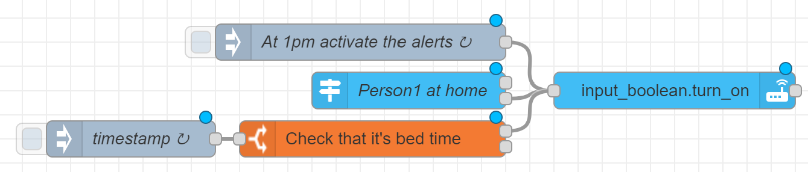
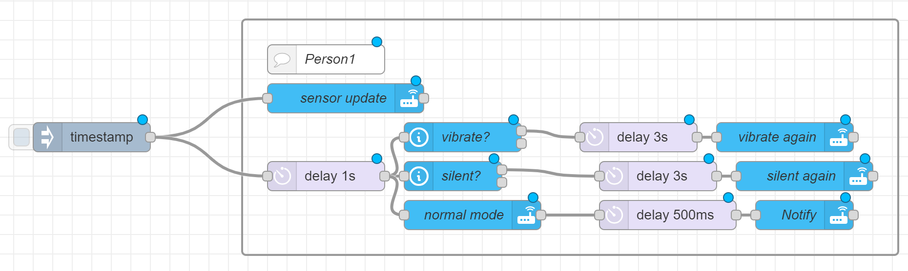

# Camera_surveillance_system
Surveillance system operated by Node Red

##### [Node Red](https://nodered.org/)
##### Personally I use [Reolink](https://reolink.com/) cameras, having people and vehicle recognition.
###### The other cameras I tried, like the TP-Link, use their own server to process the images, so the intelligent recognition stops working as soon as I block their internet access

#### As a conditional for the trigger I use non-presence at home, which I obtain thanks to the IP of the device with a fixed MAC address
As a result, in the configuration.yaml I have:
```
device_tracker:
  - platform: ping
    hosts:
      person1: !secret person1_ip
    consider_home: 100
    interval_seconds: 10
```
###### You can use this directly, or, if you want more control, you can interact it with an input_boolean

```
[{"id":"4879e8e3cf01b3d5","type":"trigger-state","z":"4c716a532f554ef5","name":"Person1 at home","server":"","version":2,"exposeToHomeAssistant":false,"haConfig":[{"property":"name","value":""},{"property":"icon","value":""}],"entityidfiltertype":"exact","debugenabled":false,"constraints":[{"targetType":"this_entity","targetValue":"","propertyType":"current_state","propertyValue":"new_state.state","comparatorType":"is","comparatorValueDatatype":"bool","comparatorValue":"true"}],"inputs":0,"outputs":2,"customoutputs":[],"outputinitially":false,"state_type":"habool","enableInput":false,"x":700,"y":640,"wires":[[],["58e2063bc8e27370"]]},{"id":"6285290d5d5a4108","type":"inject","z":"4c716a532f554ef5","name":"At 1pm activate the alerts","props":[{"p":"payload"},{"p":"topic","vt":"str"}],"repeat":"","crontab":"00 13 * * *","once":false,"onceDelay":0.1,"topic":"","payload":"","payloadType":"date","x":660,"y":600,"wires":[["58e2063bc8e27370"]]},{"id":"58e2063bc8e27370","type":"api-call-service","z":"4c716a532f554ef5","name":"","server":"","version":5,"debugenabled":false,"domain":"input_boolean","service":"turn_on","areaId":[],"deviceId":[],"entityId":["input_boolean.boolean"],"data":"","dataType":"jsonata","mergeContext":"","mustacheAltTags":false,"outputProperties":[],"queue":"none","x":920,"y":640,"wires":[[]]},{"id":"a541fe4cbe54f3a4","type":"inject","z":"4c716a532f554ef5","name":"timestamp","props":[{"p":"payload"},{"p":"topic","vt":"str"}],"repeat":"","crontab":"*/5 0-5 * * *","once":false,"onceDelay":0.1,"topic":"","payload":"","payloadType":"date","x":470,"y":680,"wires":[["15fcd250a44eee1f"]]},{"id":"15fcd250a44eee1f","type":"time-range-switch","z":"4c716a532f554ef5","name":"Check that it's bed time","lat":"","lon":"","startTime":"00:00","endTime":"05:00","startOffset":0,"endOffset":0,"x":670,"y":680,"wires":[["58e2063bc8e27370"],[]]}]
```

To receive the notification with sound even if in silent, I play with sensor.ringer_mode
###### (sensor that can be activated in the companion app settings)

```
[{"id":"20eefc769f3bca41","type":"inject","z":"4c716a532f554ef5","name":"","props":[{"p":"payload"},{"p":"topic","vt":"str"}],"repeat":"","crontab":"","once":false,"onceDelay":0.1,"topic":"","payload":"","payloadType":"date","x":180,"y":660,"wires":[["59ca3e51f75375a7","33152b1bc0a9a91c"]]},{"id":"f71e97cdc0c02c70","type":"group","z":"4c716a532f554ef5","style":{"stroke":"#999999","stroke-opacity":"1","fill":"none","fill-opacity":"1","label":true,"label-position":"nw","color":"#a4a4a4"},"nodes":["f7dc3e416c1b2e87","d18d40a53261c5d7","dab13fc387c9c28d","2ac1f6da0bd08d8b","9105b3aced88dc3a","e2ded0e23adeb30f","b9d8126e6f50b6fd","2f80aa91237ffd7c","8b880429eb88a036","59ca3e51f75375a7","33152b1bc0a9a91c","75c0b56e0cfa816c"],"x":274,"y":539,"w":672,"h":242},{"id":"f7dc3e416c1b2e87","type":"api-call-service","z":"4c716a532f554ef5","g":"f71e97cdc0c02c70","name":"Notify","server":"","version":5,"debugenabled":false,"domain":"notify","service":"mobile_app_phone","areaId":[],"deviceId":[],"entityId":[],"data":"{\t   \"message\":\"Someone detected\",\t   \"title\":\"Alarm\",\t   \"data\":{\t        \"group\": \"Surveillance\"\t   }\t}","dataType":"jsonata","mergeContext":"","mustacheAltTags":false,"outputProperties":[],"queue":"none","x":850,"y":740,"wires":[[]]},{"id":"d18d40a53261c5d7","type":"api-call-service","z":"4c716a532f554ef5","g":"f71e97cdc0c02c70","name":"normal mode","server":"","version":5,"debugenabled":false,"domain":"notify","service":"mobile_app_phone","areaId":[],"deviceId":[],"entityId":[],"data":"{\t   \"message\":\"command_ringer_mode\",\t   \"data\": {\t        \"command\":\"normal\"\t   }\t}","dataType":"jsonata","mergeContext":"","mustacheAltTags":false,"outputProperties":[],"queue":"none","x":510,"y":740,"wires":[["dab13fc387c9c28d"]]},{"id":"dab13fc387c9c28d","type":"delay","z":"4c716a532f554ef5","g":"f71e97cdc0c02c70","name":"","pauseType":"delay","timeout":"500","timeoutUnits":"milliseconds","rate":"1","nbRateUnits":"1","rateUnits":"second","randomFirst":"1","randomLast":"5","randomUnits":"seconds","drop":false,"allowrate":false,"outputs":1,"x":710,"y":740,"wires":[["f7dc3e416c1b2e87"]]},{"id":"2ac1f6da0bd08d8b","type":"api-current-state","z":"4c716a532f554ef5","g":"f71e97cdc0c02c70","name":"vibrate?","server":"","version":3,"outputs":2,"halt_if":"vibrate","halt_if_type":"str","halt_if_compare":"is","entity_id":"sensor.opandrea_ringer_mode_12","state_type":"str","blockInputOverrides":false,"outputProperties":[{"property":"payload","propertyType":"msg","value":"","valueType":"entityState"}],"for":"0","forType":"num","forUnits":"minutes","override_topic":false,"state_location":"payload","override_payload":"msg","entity_location":"data","override_data":"msg","x":500,"y":660,"wires":[["9105b3aced88dc3a"],[]]},{"id":"9105b3aced88dc3a","type":"delay","z":"4c716a532f554ef5","g":"f71e97cdc0c02c70","name":"","pauseType":"delay","timeout":"3","timeoutUnits":"seconds","rate":"1","nbRateUnits":"1","rateUnits":"second","randomFirst":"1","randomLast":"5","randomUnits":"seconds","drop":false,"allowrate":false,"outputs":1,"x":680,"y":660,"wires":[["e2ded0e23adeb30f"]]},{"id":"e2ded0e23adeb30f","type":"api-call-service","z":"4c716a532f554ef5","g":"f71e97cdc0c02c70","name":"vibrate again","server":"","version":5,"debugenabled":false,"domain":"notify","service":"mobile_app_phone","areaId":[],"deviceId":[],"entityId":[],"data":"{\t   \"message\":\"command_ringer_mode\",\t   \"data\": {\t        \"command\":\"vibrate\"\t   }\t}","dataType":"jsonata","mergeContext":"","mustacheAltTags":false,"outputProperties":[],"queue":"none","x":830,"y":660,"wires":[[]]},{"id":"b9d8126e6f50b6fd","type":"api-current-state","z":"4c716a532f554ef5","g":"f71e97cdc0c02c70","name":"silent?","server":"","version":3,"outputs":2,"halt_if":"silent","halt_if_type":"str","halt_if_compare":"is","entity_id":"sensor.opandrea_ringer_mode_12","state_type":"str","blockInputOverrides":false,"outputProperties":[{"property":"payload","propertyType":"msg","value":"","valueType":"entityState"}],"for":"0","forType":"num","forUnits":"minutes","override_topic":false,"state_location":"payload","override_payload":"msg","entity_location":"data","override_data":"msg","x":490,"y":700,"wires":[["2f80aa91237ffd7c"],[]]},{"id":"2f80aa91237ffd7c","type":"delay","z":"4c716a532f554ef5","g":"f71e97cdc0c02c70","name":"","pauseType":"delay","timeout":"3","timeoutUnits":"seconds","rate":"1","nbRateUnits":"1","rateUnits":"second","randomFirst":"1","randomLast":"5","randomUnits":"seconds","drop":false,"allowrate":false,"outputs":1,"x":700,"y":700,"wires":[["8b880429eb88a036"]]},{"id":"8b880429eb88a036","type":"api-call-service","z":"4c716a532f554ef5","g":"f71e97cdc0c02c70","name":"silent again","server":"","version":5,"debugenabled":false,"domain":"notify","service":"mobile_app_phone","areaId":[],"deviceId":[],"entityId":[],"data":"{\t   \"message\":\"command_ringer_mode\",\t   \"data\": {\t        \"command\":\"silent\"\t   }\t}","dataType":"jsonata","mergeContext":"","mustacheAltTags":false,"outputProperties":[],"queue":"none","x":850,"y":700,"wires":[[]]},{"id":"59ca3e51f75375a7","type":"api-call-service","z":"4c716a532f554ef5","g":"f71e97cdc0c02c70","name":"sensor update","server":"","version":5,"debugenabled":false,"domain":"notify","service":"mobile_app_phone","areaId":[],"deviceId":[],"entityId":[],"data":"{\t   \"message\":\"command_update_sensors\"\t}","dataType":"jsonata","mergeContext":"","mustacheAltTags":false,"outputProperties":[],"queue":"none","x":380,"y":620,"wires":[[]]},{"id":"33152b1bc0a9a91c","type":"delay","z":"4c716a532f554ef5","g":"f71e97cdc0c02c70","name":"","pauseType":"delay","timeout":"1","timeoutUnits":"seconds","rate":"1","nbRateUnits":"1","rateUnits":"second","randomFirst":"1","randomLast":"5","randomUnits":"seconds","drop":false,"allowrate":false,"outputs":1,"x":360,"y":700,"wires":[["b9d8126e6f50b6fd","2ac1f6da0bd08d8b","d18d40a53261c5d7"]]},{"id":"75c0b56e0cfa816c","type":"comment","z":"4c716a532f554ef5","g":"f71e97cdc0c02c70","name":"Person1","info":"","x":360,"y":580,"wires":[]}]
```
